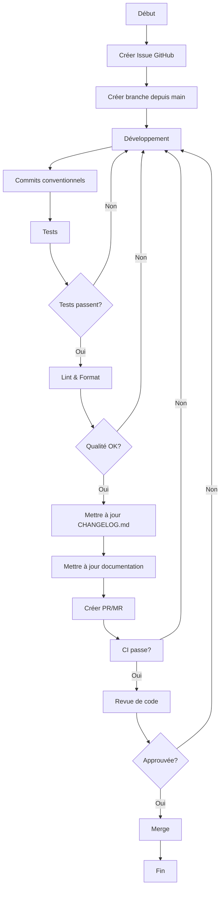

# 🤖 Guide de développement pour l'Agent

> Ce fichier contient les règles et processus que l'agent IA doit suivre pour toute modification du projet RipApi.

---

## 📋 Checklist obligatoire pour toute modification

Avant toute modification du code, l'agent **DOIT** suivre cette checklist dans l'ordre:

### ✅ 1. Création d'Issue GitHub

- [ ] Créer une issue GitHub décrivant la modification
  - Titre clair et descriptif
  - Description détaillée du problème/fonctionnalité
  - Labels appropriés (`feature`, `bug`, `enhancement`, `documentation`, etc.)
  - Milestone si applicable
  - Référence à la ROADMAP.md si applicable

**Exemple de création d'issue:**

```markdown
Title: feat(graphql): Add GraphQL introspection support

**Description:**
Implement GraphQL schema introspection to allow users to explore API schemas directly from the UI.

**Acceptance Criteria:**

- [ ] Introspection query execution
- [ ] Schema explorer UI component
- [ ] Documentation display
- [ ] Tests added

**Related:**

- Roadmap: Fonctionnalités API > GraphQL > Introspection
```

### ✅ 2. Création de branche

- [ ] Créer une branche depuis `main` suivant la convention:
  ```
  <type>/<issue-number>-<short-description>
  ```

**Types de branches:**

- `feature/` - Nouvelle fonctionnalité
- `fix/` - Correction de bug
- `docs/` - Documentation uniquement
- `refactor/` - Refactoring
- `test/` - Ajout de tests
- `chore/` - Maintenance, dépendances

**Exemples:**

```bash
feature/123-graphql-introspection
fix/456-auth-token-expiration
docs/789-update-api-reference
```

### ✅ 3. Développement avec commits conventionnels

- [ ] Faire des commits atomiques
- [ ] Suivre [Conventional Commits](https://www.conventionalcommits.org/)
- [ ] Format: `<type>(<scope>): <description>`

**Types de commits:**

- `feat`: Nouvelle fonctionnalité
- `fix`: Correction de bug
- `docs`: Documentation
- `style`: Formatage
- `refactor`: Refactoring
- `perf`: Performance
- `test`: Tests
- `chore`: Maintenance
- `ci`: CI/CD
- `build`: Build system

**Exemples de commits:**

```bash
git commit -m "feat(graphql): add introspection query support"
git commit -m "test(graphql): add introspection tests"
git commit -m "docs(graphql): update API documentation"
git commit -m "fix(auth): resolve token expiration edge case"
```

### ✅ 4. Tests obligatoires

- [ ] Tests unitaires pour toute nouvelle fonction/classe
- [ ] Tests d'intégration pour les workflows
- [ ] Tests E2E pour les features utilisateur
- [ ] Coverage minimum 80% maintenu
- [ ] Tous les tests passent localement

**Commandes:**

```bash
npm run test              # Tous les tests
npm run test:unit         # Tests unitaires
npm run test:integration  # Tests d'intégration
npm run test:e2e         # Tests E2E
npm run test:coverage    # Vérifier coverage
```

### ✅ 5. Qualité du code

- [ ] Lint sans erreurs
- [ ] Formatage Prettier appliqué
- [ ] TypeScript strict mode respecté
- [ ] Pas de `any` non justifiés
- [ ] Accessibilité vérifiée (RGAA)

**Commandes:**

```bash
npm run lint           # Vérifier le code
npm run lint:fix       # Corriger automatiquement
npm run format         # Formater le code
npm run format:check   # Vérifier le formatage
npm run type-check     # Vérifier TypeScript
```

### ✅ 6. Documentation

- [ ] JSDoc pour fonctions publiques
- [ ] README.md mis à jour si nécessaire
- [ ] Documentation API mise à jour
- [ ] CHANGELOG.md mis à jour
- [ ] Commentaires pour logique complexe

**Template JSDoc:**

````typescript
/**
 * Description de la fonction
 * @param paramName - Description du paramètre
 * @returns Description du retour
 * @throws {ErrorType} Description de l'erreur
 * @example
 * ```typescript
 * const result = myFunction('example');
 * ```
 */
export function myFunction(paramName: string): ReturnType {
	// ...
}
````

### ✅ 7. CHANGELOG.md

- [ ] Ajouter une entrée dans CHANGELOG.md sous `## [Unreleased]`
- [ ] Catégorie appropriée: Added, Changed, Deprecated, Removed, Fixed, Security
- [ ] Référence à l'issue: `(#123)`

**Format:**

```markdown
## [Unreleased]

### Added

- GraphQL introspection support (#123)

### Fixed

- Token expiration bug in authentication flow (#456)

### Changed

- Updated API response format for better consistency (#789)
```

### ✅ 8. Création de Merge Request / Pull Request

- [ ] Push la branche vers origin
- [ ] Créer une MR/PR vers `main`
- [ ] Titre suivant Conventional Commits
- [ ] Description complète avec:
  - Résumé des changements
  - Référence à l'issue: `Closes #123`
  - Captures d'écran si UI
  - Instructions de test
  - Checklist de revue

**Template de PR:**

```markdown
## Description

Brief description of the changes

Closes #123

## Type of change

- [ ] Bug fix
- [x] New feature
- [ ] Breaking change
- [ ] Documentation update

## Changes

- Added GraphQL introspection query support
- Implemented schema explorer UI component
- Added comprehensive tests

## Screenshots (if applicable)

[Add screenshots here]

## Testing

- [ ] Unit tests pass
- [ ] Integration tests pass
- [ ] E2E tests pass
- [ ] Manual testing completed

## Checklist

- [x] Code follows style guidelines
- [x] Self-review completed
- [x] Comments added for complex code
- [x] Documentation updated
- [x] No new warnings generated
- [x] Tests added
- [x] All tests pass
- [x] CHANGELOG.md updated
```

### ✅ 9. Vérification CI

- [ ] Attendre que la CI passe entièrement
- [ ] Corriger les erreurs si échec
- [ ] Vérifier coverage maintenu/amélioré
- [ ] Pas de régression de performance

**CI Checks obligatoires:**

- ✅ Lint
- ✅ Tests unitaires
- ✅ Tests d'intégration
- ✅ Tests E2E
- ✅ Build
- ✅ Security scan
- ✅ Accessibility tests
- ✅ Coverage check (≥80%)

### ✅ 10. Semver et versioning

- [ ] Déterminer l'impact de la modification selon [Semantic Versioning](https://semver.org/):
  - **MAJOR** (x.0.0): Breaking changes
  - **MINOR** (0.x.0): New features (backward compatible)
  - **PATCH** (0.0.x): Bug fixes (backward compatible)

**Exemples:**

- Nouvelle fonctionnalité (backward compatible): MINOR
- Correction de bug: PATCH
- Changement d'API incompatible: MAJOR
- Documentation seule: Pas de bump de version

---

## 🔄 Workflow complet


```mermaid
graph TD
    A[Début] --> B[Créer Issue GitHub]
    B --> C[Créer branche depuis main]
    C --> D[Développement]
    D --> E[Commits conventionnels]
    E --> F[Tests]
    F --> G{Tests passent?}
    G -->|Non| D
    G -->|Oui| H[Lint & Format]
    H --> I{Qualité OK?}
    I -->|Non| D
    I -->|Oui| J[Mettre à jour CHANGELOG.md]
    J --> K[Mettre à jour documentation]
    K --> L[Créer PR/MR]
    L --> M[CI passe?]
    M -->|Non| D
    M -->|Oui| N[Revue de code]
    N --> O{Approuvée?}
    O -->|Non| D
    O -->|Oui| P[Merge]
    P --> Q[Fin]
```

---

## 📝 Exemple de workflow complet

### Scénario: Ajouter support GraphQL introspection

#### 1. Créer l'issue

```bash
# Via GitHub API ou UI
Issue #123: feat(graphql): Add GraphQL introspection support
```

#### 2. Créer la branche

```bash
git checkout main
git pull origin main
git checkout -b feature/123-graphql-introspection
```

#### 3. Développement

```typescript
// src/lib/services/graphql/introspection.ts
/**
 * Executes GraphQL introspection query
 * @param endpoint - GraphQL endpoint URL
 * @returns Schema information
 */
export async function introspectSchema(endpoint: string): Promise<Schema> {
	// Implementation
}
```

#### 4. Tests

```typescript
// tests/unit/services/graphql/introspection.test.ts
import { describe, it, expect } from 'vitest';
import { introspectSchema } from '$lib/services/graphql/introspection';

describe('introspectSchema', () => {
	it('should fetch schema successfully', async () => {
		const schema = await introspectSchema('https://api.example.com/graphql');
		expect(schema).toBeDefined();
		expect(schema.types).toBeInstanceOf(Array);
	});
});
```

#### 5. Commits

```bash
git add src/lib/services/graphql/introspection.ts
git commit -m "feat(graphql): add introspection query service"

git add tests/unit/services/graphql/introspection.test.ts
git commit -m "test(graphql): add introspection tests"

git add src/lib/components/GraphQLExplorer.svelte
git commit -m "feat(graphql): add schema explorer UI component"

git add docs/api/graphql.md
git commit -m "docs(graphql): add introspection documentation"
```

#### 6. CHANGELOG

```markdown
## [Unreleased]

### Added

- GraphQL schema introspection support (#123)
- Schema explorer UI component for GraphQL endpoints (#123)
```

#### 7. Create PR

```bash
git push origin feature/123-graphql-introspection
# Create PR on GitHub with proper description
```

#### 8. Wait for CI & Review

- CI passes ✅
- Code review approved ✅
- Merge to main ✅

---

## 🎯 Règles spécifiques par type de modification

### Features (Nouvelles fonctionnalités)

- **Issue**: Label `feature`, description détaillée, acceptance criteria
- **Branch**: `feature/<issue>-<description>`
- **Tests**: Unit + Integration + E2E
- **Docs**: README, API docs, exemples
- **CHANGELOG**: Section "Added"
- **Semver**: MINOR (si backward compatible)

### Fixes (Corrections de bugs)

- **Issue**: Label `bug`, étapes de reproduction, comportement attendu
- **Branch**: `fix/<issue>-<description>`
- **Tests**: Reproduire le bug, puis vérifier correction
- **Docs**: Si comportement documenté a changé
- **CHANGELOG**: Section "Fixed"
- **Semver**: PATCH

### Refactoring

- **Issue**: Label `refactor`, justification
- **Branch**: `refactor/<issue>-<description>`
- **Tests**: Tous les tests existants doivent passer
- **Docs**: Si signatures changent
- **CHANGELOG**: Section "Changed" si impact visible
- **Semver**: PATCH (si pas de changement de comportement)

### Documentation

- **Issue**: Label `documentation`
- **Branch**: `docs/<issue>-<description>`
- **Tests**: Tests de liens cassés, exemples de code
- **CHANGELOG**: Optionnel pour doc seule
- **Semver**: Pas de bump

### Breaking Changes

- **Issue**: Label `breaking`, migration guide
- **Branch**: `feature/<issue>-<description>` or `refactor/<issue>-<description>`
- **Commit**: Utiliser `!` ou `BREAKING CHANGE:` dans le footer
- **Tests**: Tous les anciens et nouveaux tests
- **Docs**: Guide de migration détaillé
- **CHANGELOG**: Section "Changed" avec warning ⚠️
- **Semver**: MAJOR

**Exemple commit breaking:**

```bash
git commit -m "feat(api)!: change authentication flow

BREAKING CHANGE: Authentication endpoint now requires different payload format.
See migration guide in docs/migration/v2.md"
```

---

## 🔒 Règles de sécurité spécifiques

### Avant chaque commit

- [ ] Scan des secrets (git-secrets, gitleaks)
- [ ] Pas de clés API hardcodées
- [ ] Pas de mots de passe en clair
- [ ] Variables d'environnement pour secrets
- [ ] Logs ne contiennent pas de données sensibles

### Avant chaque PR

- [ ] Scan de dépendances (npm audit)
- [ ] Pas de vulnérabilités connues
- [ ] Scan SAST (analyse statique)
- [ ] Headers de sécurité vérifiés

### Commandes de vérification

```bash
# Scan de secrets
npm run security:secrets

# Audit des dépendances
npm audit
npm audit fix

# Scan de vulnérabilités
npm run security:scan
```

---

## ♿ Règles d'accessibilité (RGAA)

### Avant chaque modification UI

- [ ] Contraste minimum respecté (4.5:1)
- [ ] Navigation au clavier fonctionnelle
- [ ] Labels ARIA appropriés
- [ ] Rôles ARIA corrects
- [ ] Focus visible
- [ ] Textes alternatifs pour images

### Tests d'accessibilité

```bash
# Tests automatisés
npm run test:a11y

# Vérification manuelle
# - Navigation au clavier (Tab, Shift+Tab, Enter, Espace)
# - Lecteur d'écran (NVDA, JAWS, VoiceOver)
# - Zoom texte 200%
```

### Checklist composant accessible

```svelte
<script lang="ts">
	export let label: string;
	export let id: string;

	let inputValue = '';
</script>

<!-- ✅ Bon: Label associé, ARIA, focus visible -->
<div class="form-field">
	<label for={id}>{label}</label>
	<input
		{id}
		bind:value={inputValue}
		type="text"
		aria-describedby="{id}-help"
		aria-required="true"
	/>
	<span id="{id}-help" class="help-text"> Format: xxx-xxx-xxxx </span>
</div>

<style>
	input:focus {
		outline: 2px solid var(--color-focus);
		outline-offset: 2px;
	}
</style>
```

---

## 📊 Métriques de qualité à respecter

### Code Coverage

- **Minimum**: 80%
- **Cible**: 90%
- **Fichiers critiques**: 100%

### Performance

- **Lighthouse Score**: ≥90
- **First Contentful Paint**: <1.5s
- **Time to Interactive**: <3s
- **Bundle size**: Monitorer (pas de régression >10%)

### Accessibilité

- **axe-core**: 0 violations
- **Lighthouse Accessibility**: 100
- **WAVE**: 0 erreurs

### Sécurité

- **npm audit**: 0 vulnérabilités high/critical
- **Snyk score**: A
- **Headers score**: A+ (securityheaders.com)

---

## 🚫 Ce qu'il ne faut JAMAIS faire

### ❌ Interdictions absolues

1. **Commit direct sur `main`**
   - Toujours passer par une branche et PR

2. **Merge sans CI passing**
   - CI doit être verte avant merge

3. **Merge sans revue**
   - Au moins 1 approbation requise

4. **Secrets dans le code**
   - Utiliser variables d'environnement

5. **Dépendances avec vulnérabilités**
   - Corriger avant merge

6. **Breaking changes sans MAJOR version**
   - Respecter semver strictement

7. **Code non testé**
   - Coverage doit être maintenu

8. **Ignorer les erreurs lint**
   - Tout doit passer

9. **Documentation non mise à jour**
   - Synchroniser code et docs

10. **Commits non conventionnels**
    - Format strict obligatoire

---

## 🎓 Ressources et références

### Documentation officielle

- [Conventional Commits](https://www.conventionalcommits.org/)
- [Semantic Versioning](https://semver.org/)
- [Keep a Changelog](https://keepachangelog.com/)
- [Git Flow](https://nvie.com/posts/a-successful-git-branching-model/)

### Outils recommandés

- [Commitizen](https://github.com/commitizen/cz-cli) - Aide aux commits
- [Husky](https://typicode.github.io/husky/) - Git hooks
- [lint-staged](https://github.com/okonet/lint-staged) - Lint pre-commit
- [commitlint](https://commitlint.js.org/) - Vérification commits

---

## 📞 En cas de doute

1. Vérifier ROADMAP.md
2. Vérifier CONTRIBUTING.md
3. Vérifier ce fichier (DEVELOPMENT.md)
4. Créer une discussion GitHub
5. Demander sur Discord (si disponible)

---

**Version:** 1.0.0  
**Dernière mise à jour:** 2025-12-02  
**Maintenu par:** Équipe RipApi
